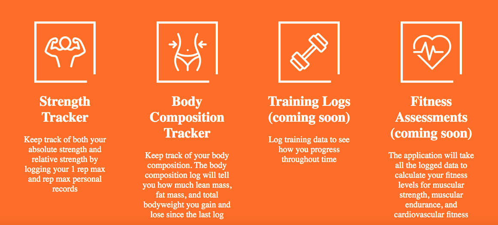
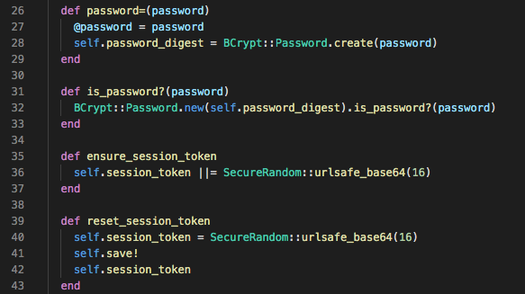
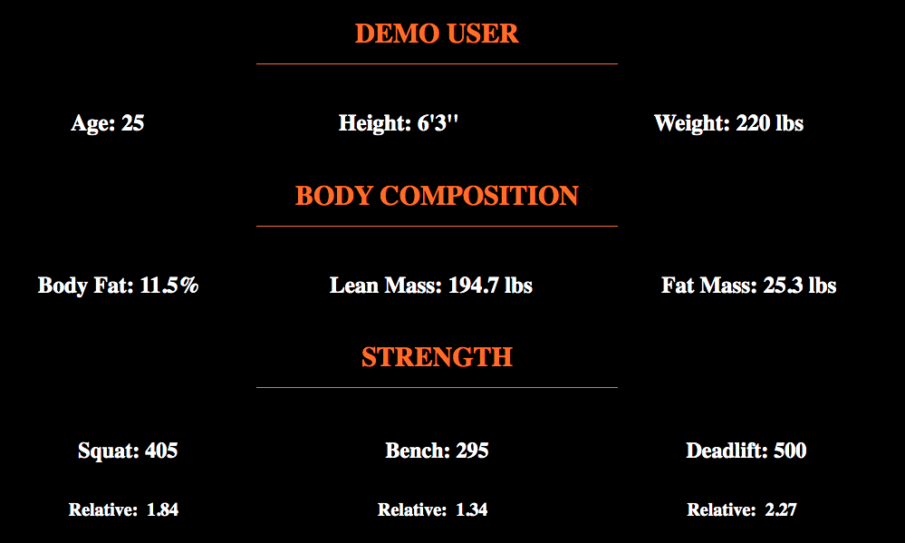
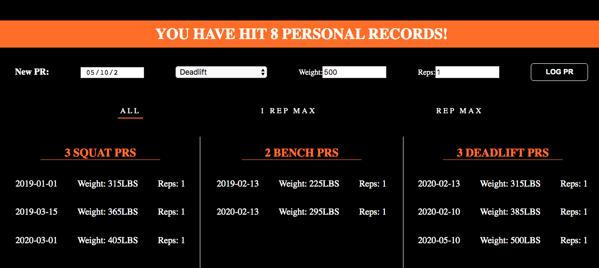
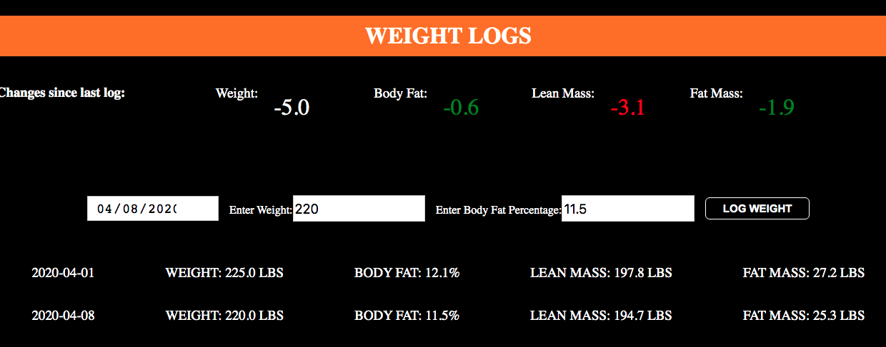

# PR Tracker
[View the live site](https://personal-record-tracker.herokuapp.com/)

PR Tracker is a single-page web application where athletes can track personal records and body composition.

# Technologies Used
### Backend
* Ruby on Rails
* PostgreSQL
### Frontend
* React/Redux
### Other
* SCSS
* Webpack
* Heroku

# Features
* User Authentication
* Fitness Stats
* Personal Record History
* Weight Logs

### User Authentication
Users can create an account and log in. User authentication for this web application was made using the BCrypt gem and SecureRandom module. 

***

### Fitness Stats
General information, absolute strength, relative strength, and body composition is calculated and displayed based on previous personal records and weight logs.

***

### Personal Record History
Users can log one rep max and rep max personal records for squat, bench, and deadlift. Personal records are grouped by exercise.

***

### Weight Logs
Users can log weight and body fat percentage. Lean mass and fat mass are calculated and body composition from most current log is compared with previous log. 

***

